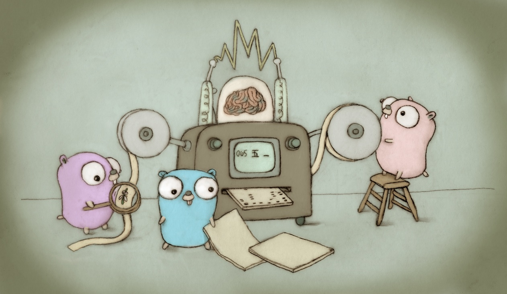

# The Go Programming Language

For documentation about how to install and use Go,
visit http://golang.org/ or load doc/install-source.html
in your web browser.

Our canonical Git repository is located at https://go.googlesource.com/go.
(There is a mirror of the repository at https://github.com/golang/go.)

Please report issues here: https://github.com/golang/go/issues

Go is the work of hundreds of contributors. We appreciate your help!

To contribute, please read the contribution guidelines:
	http://golang.org/doc/contribute.html

Unless otherwise noted, the Go source files are distributed
under the BSD-style license found in the LICENSE file.

--

## Binary Distribution Notes

If you have just untarred a binary Go distribution, you need to set
the environment variable $GOROOT to the full path of the go
directory (the one containing this README).  You can omit the
variable if you unpack it into /usr/local/go, or if you rebuild
from sources by running all.bash (see doc/install.html).
You should also add the Go binary directory $GOROOT/bin
to your shell's path.

For example, if you extracted the tar file into $HOME/go, you might
put the following in your .profile:

	export GOROOT=$HOME/go
	export PATH=$PATH:$GOROOT/bin

See https://golang.org/doc/install or doc/install.html for more details.

