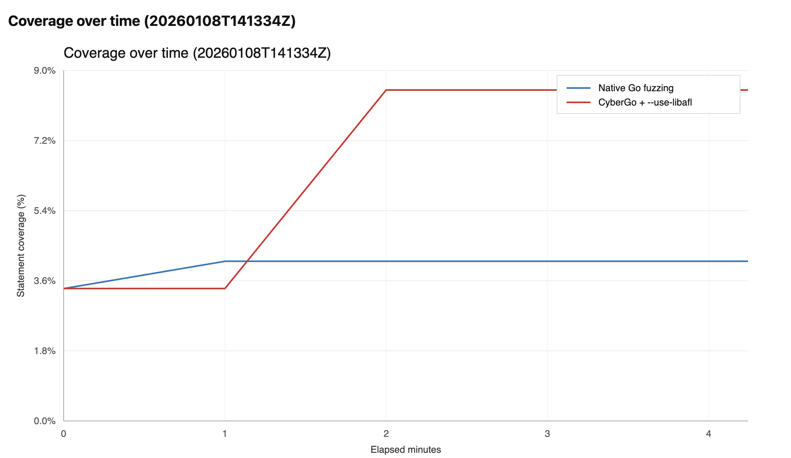
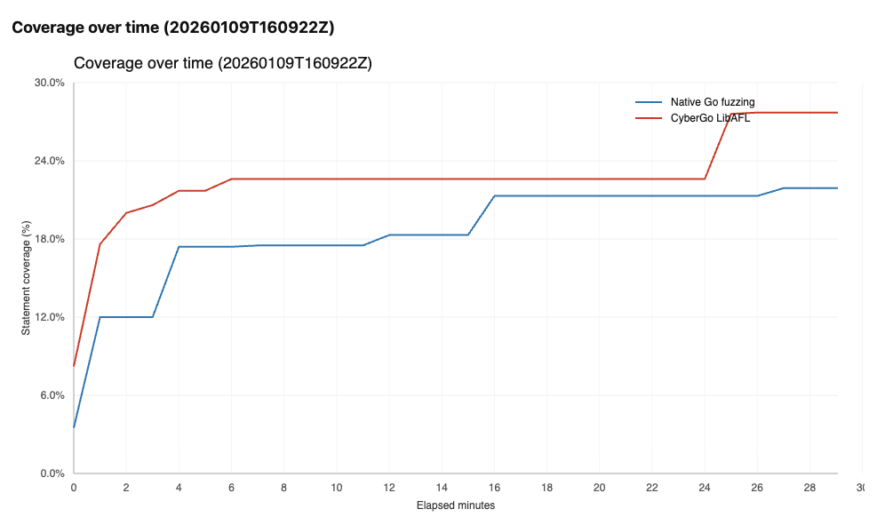

# cybergo

[](https://github.com/kevin-valerio/cybergo/actions/workflows/go.yml)

cybergo is a security-focused fork of the Go toolchain. In a _very_ simple phrasing, cybergo is a copy of the Go compiler that finds bugs. For now, it focuses on four things:

- Integrating [go-panikint](https://github.com/trailofbits/go-panikint): instrumentation that panics on **integer overflow/underflow** (and **optionally on truncating integer conversions**).
- Integrating [LibAFL](https://github.com/AFLplusplus/LibAFL) fuzzer: run Go fuzzing harnesses with **LibAFL** for better fuzzing performances.
- Panicking on [user-provided function call](https://github.com/kevin-valerio/cybergo?tab=readme-ov-file#feature-2-panic-on-selected-functions): catching targeted bugs when certains functions are called (eg., `myapp.(*Logger).Error`).
- Git-blame-oriented fuzzing (history-guided): when fuzzing with `--use-libafl`, you can prefer inputs that execute recently changed lines (based on `git blame`).

It especially has **two** objectives:
- Being easy to use and UX-friendly (we're tired of complex tools),
- Helping to find bugs in Go codebases via built-in security implementations.

## Table of Contents

- [Build](#build)
  - [Feature 1: Integer overflow and truncation issues detection](#feature-1-integer-overflow-and-truncation-issues-detection)
  - [Feature 2: Panic on selected functions](#feature-2-panic-on-selected-functions)
  - [Feature 3: LibAFL state-of-the-art fuzzing](#feature-3-libafl-state-of-the-art-fuzzing)
  - [Feature 4: Git-blame-oriented fuzzing](#feature-4-git-blame-oriented-fuzzing)
- [Credits](#credits)

## Build
```bash
cd src && ./make.bash # This produces `./bin/go`. See `GOFLAGS` below.
```

## Feature 1: Integer overflow and truncation issues detection

#### Overview

This work is inspired from the previously developed [go-panikint](https://github.com/trailofbits/go-panikint). It adds overflow/underflow detection for integer arithmetic operations and (optionnally) type truncation detection for integer conversions. When overflow or truncation is detected, a panic with a detailed error message is triggered, including the specific operation type and integer types involved.

_Arithmetic operations_: Handles addition `+`, subtraction `-`, multiplication `*`, and division `/` for both signed and unsigned integer types. For signed integers, covers `int8`, `int16`, `int32`. For unsigned integers, covers `uint8`, `uint16`, `uint32`, `uint64`. The division case specifically detects the `MIN_INT / -1` overflow condition for signed integers. `int64` and `uintptr` are not checked for arithmetic operations.

_Type truncation detection_: Detects potentially lossy integer type conversions. Covers all integer types: `int8`, `int16`, `int32`, `int64`, `uint8`, `uint16`, `uint32`, `uint64`. Excludes `uintptr` due to platform-dependent usage. This is disabled by default.

Overflow detection is enabled by default. To disable it, add `GOFLAGS='-gcflags=-overflowdetect=false'` before your `./make.bash`. You can also enable truncation issues checker with: `-gcflags=-truncationdetect=true`

#### How it works

This feature patches the compiler SSA generation so that integer arithmetic operations and integer conversions get extra runtime checks that call into the runtime to panic with a detailed error message when a bug is detected. Checks are applied using source-location-based filtering so user code is instrumented while standard library files and dependencies (module cache and `vendor/`) are skipped.

You can read the associated blog post about it [**here**](https://blog.trailofbits.com/2025/12/31/detect-gos-silent-arithmetic-bugs-with-go-panikint/).

#### Suppressing false positives

Add a marker on the same line as the operation or the line immediately above to suppress a specific report:

- Overflow/underflow: `overflow_false_positive`
- Truncation: `truncation_false_positive`

Example:

```go
// overflow_false_positive
intentionalOverflow := a + b
// truncation_false_positive
x := uint8(big)
sum2 := a + b // overflow_false_positive
x2 := uint8(big) // truncation_false_positive
```

Sometimes this might not work, that's because Go is in-lining the function. If `// overflow_false_poistive` isn't enough, add `//go:noinline` before the signature of your function.

## Feature 2: Panic on selected functions

When fuzzing targets, we may be interested in triggering a panic when certain functions are called. For example, some software may emit `log.error` messages instead of panicking, even though such conditions often indicate states that security researchers would want to detect during fuzzing.
However, these errors are usually handled internally (e.g., through retry or pause mechanisms, or by printing messages to logs), which makes them largely invisible to fuzzers. The objective of this feature is to address this issue.

#### How to use

Compile cybergo, then use the `--panic-on` flag.

```bash
./bin/go test -fuzz=FuzzHarness --use-libafl --focus-on-new-code=false --panic-on="test_go_panicon.(*Logger).Warning,test_go_panicon.(*Logger).Error"
```

The example above would panic when either `(*Logger).Warning` or `(*Logger).Error` is called (comma-separated list).

<details>
<summary><strong>How panic on selected functions feature works</strong></summary>

```text
┌───────────────────────────────────────────────────────────────────────────┐
│ 1) cybergo `go test`                                                      │
│    - parses + validates `-panic-on=...` against packages being built      │
│    - forwards patterns to the compiler via `-panic-on-call=...`           │
└───────────────┬───────────────────────────────────────────────────────────┘
                v
┌───────────────────────────────────────────────────────────────────────────┐
│ 2) `cmd/compile`                                                          │
│    - prevents inlining of matching calls so the call stays visible        │
│    - SSA pass inserts a call to `runtime.panicOnCall(...)`                │
└───────────────┬───────────────────────────────────────────────────────────┘
                v
┌───────────────────────────────────────────────────────────────────────────┐
│ 3) `runtime.panicOnCall`                                                  │
│    - panics with: "panic-on-call: func-name"                              │
└───────────────────────────────────────────────────────────────────────────┘
```

In practice, this makes any matched call site behave like a crash/panic for fuzzers (note: only static call sites can be trapped).
</details>

## Feature 3: LibAFL state-of-the-art fuzzing

LibAFL performs *way* better than the traditional Go fuzzer. Using the `--use-libafl` flag runs standard Go fuzz tests (`go test -fuzz=...`) **with** [LibAFL](https://github.com/AFLplusplus/LibAFL). The runner is implemented in `golibafl/`. Without `--use-libafl`, the fuzzer behaves like upstream Go. More documentation in [this Markdown file.](misc/cybergo/USE_LIBAFL.md)

You can also pass an optional config. file for LibAFL, see [here.](misc/cybergo/libafl.config.jsonc)

```bash
./bin/go test -fuzz=FuzzHarness --use-libafl --focus-on-new-code=false --libafl-config=path/to/libafl.jsonc # optionnal --libafl-config
```

<details>
<summary><strong>How Go + LibAFL are wired together</strong></summary>

```text
┌───────────────────────────────────────────────────────────────────────────┐
│ 1) cybergo `go test`                                                      │
│    - captures  `testing.F.Fuzz(...)` callback                             │
│    - generates  extra source file: `_libaflmain.go`                       │
└───────────────┬───────────────────────────────────────────────────────────┘
                v
┌───────────────────────────────────────────────────────────────────────────┐
│ 2) Generated bridge: `_libaflmain.go`                                     │
│    - provides libFuzzer-style C ABI entrypoints:                          │
│        LLVMFuzzerInitialize                                               │
│        LLVMFuzzerTestOneInput                                             │
│    - adapts bytes -> Go types -> calls the captured fuzz callback         │
└───────────────┬───────────────────────────────────────────────────────────┘ 
                v
┌───────────────────────────────────────────────────────────────────────────┐
│ 3) `libharness.a` (static archive on disk) contains:                      │
│      - compiled objects for all test package (+ dependencies)             │
│      - generated `_testmain.go` + `_libaflmain.go`                        │
│      - LLVMFuzzerInitialize                                               │
│      - LLVMFuzzerTestOneInput                                             │
└───────────────┬───────────────────────────────────────────────────────────┘
                v
┌───────────────────────────────────────────────────────────────────────────┐
│ 4) `golibafl/` (Rust + LibAFL)                                            │
│    env: HARNESS_LIB=/path/to/libharness.a                                 │
│    fuzz loop: mutate input -> LLVMFuzzerTestOneInput(data) -> observe     │
└───────────────────────────────────────────────────────────────────────────┘
```

In `--use-libafl` mode, cybergo builds `libharness.a` and the Rust `golibafl` runner drives it in-process via the libFuzzer entrypoints.
</details>


##### Limitations
Let's talk about the motivation behind using LibAFL. Fuzzing with `go test -fuzz` is _far_ behind the state-of-the-art fuzzing techniques. A good example for this is AFL++'s CMPLOG/Redqueen. Those features allow fuzzers to solve certain constraints. Let's assume the following snippet
```go
if input == "IMARANDOMSTRINGJUSTCMPLOGMEMAN" {
	panic("this string is illegal")
}
```
SOTA fuzzers like AFL++ or LibAFL would find the panic instantly in that case. However, Go native fuzzer wouldn't. That is a massive gap that restrains coverage exploration by a **lot**.

The benchmark below show those limits. Note that those benchmarks can be **reproduced** and improved via the [cybergo-bench-libafl repository](https://github.com/kevin-valerio/cybergo-bench-libafl/tree/main).

##### Benchmark 1:

The chart below is the evolution of the number of lines covered while fuzzing Google's [UUID](https://github.com/google/uuid) using LibAFL vs go native fuzzer.


##### Benchmark 2:

The chart below is the evolution of the number of lines covered while fuzzing [go-ethereum](https://github.com/ethereum/go-ethereum) using LibAFL vs go native fuzzer.



#### Example
You can test it on some fuzzing harnesses in `test/cybergo/examples/`.

```bash
cd test/cybergo/examples/reverse
../../../../bin/go test -fuzz=FuzzReverse --use-libafl --focus-on-new-code=false
```

## Feature 4: Git-blame-oriented fuzzing

#### Overview

Coverage-guided fuzzing is great at exploring new paths, but it treats all covered code as equally interesting. When fuzzing large codebases, you may want to bias the fuzzer toward recently modified code, where regressions and bugs are more likely to be introduced. In `--use-libafl` mode, cybergo can use `git blame` to prefer inputs that execute recently changed lines (while keeping coverage guidance as the primary signal).

This work is based on previous work from [LibAFL-git-aware](https://github.com/kevin-valerio/LibAFL-git-aware). All the technical in-depth details are documented there.

#### How to use

Enable git-aware scheduling with `--focus-on-new-code=true`:

```bash
./bin/go test -fuzz=FuzzHarness --use-libafl --focus-on-new-code=true
```

This mode needs `git` (to run `git blame`) and an `addr2line` implementation to map coverage counters back to source `file:line` (prefer `llvm-addr2line`; fall back to binutils `addr2line`).

<details>
<summary><strong>How git-blame-oriented fuzzing works</strong></summary>

```text
┌───────────────────────────────────────────────────────────────────────────┐
│ 1) cybergo `go test -fuzz`                                                │
│    - builds `libharness.a` (contains `go.o` + `.go.fuzzcntrs`)            │
│    - runs `golibafl` with `GOLIBAFL_FOCUS_ON_NEW_CODE=1`                  │
└───────────────┬───────────────────────────────────────────────────────────┘
                v
┌───────────────────────────────────────────────────────────────────────────┐
│ 2) `golibafl` generates a cached "git recency map"                         │
│    - maps coverage counters -> (file:line) via DWARF / (llvm-)addr2line   │
│    - runs `git blame` to get a timestamp per line                         │
│    - stores timestamps in `git_recency_map.bin`                           │
└───────────────┬───────────────────────────────────────────────────────────┘
                v
┌───────────────────────────────────────────────────────────────────────────┐
│ 3) LibAFL scheduler uses the recency map                                  │
│    - coverage decides what enters the corpus                              │
│    - among the corpus, prioritize inputs that hit newer lines             │
└───────────────────────────────────────────────────────────────────────────┘
```
</details>

## Credits

Credits to Bruno Produit and Nills Ollrogge for their work on [golibafl](https://github.com/srlabs/golibafl/).
