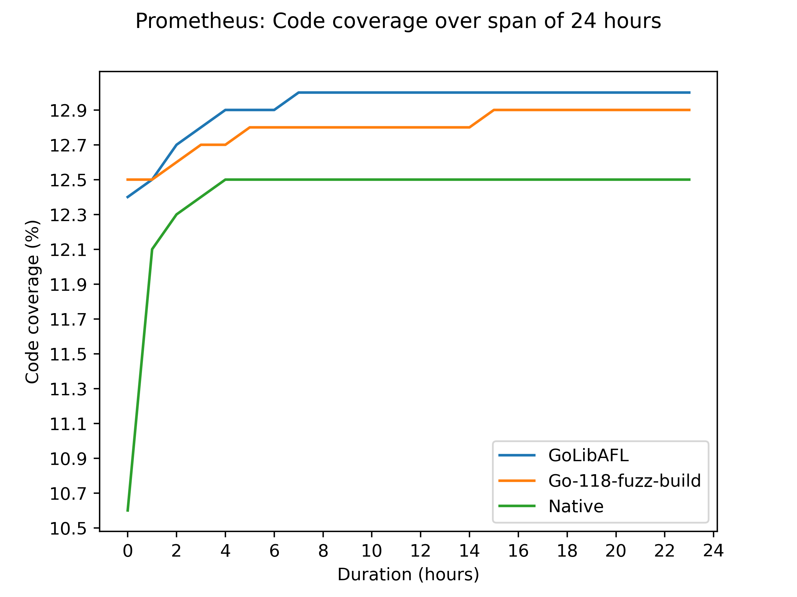

# GoLibAFL

## Introduction
This project provides a setup for fuzzing golang binaries using [LibAFL](https://github.com/AFLplusplus/LibAFL).
By leveraging Go’s native libFuzzer-compatible instrumentation (`sancov_8bit`), we enable advanced fuzzing capabilities beyond Go’s built-in fuzzing support.

- **In-process fuzzing** for maximum performance.
- **Coverage-guided fuzzing with comparison tracing support** for guided mutation.
- **Interoperability with Go** via Foreign Function Interface (FFI).

## Performance
Across all our 24-hour benchmarks, GoLibAFL consistently achieved higher code coverage than existing Go fuzzing solutions. Below is the result for the [prometheus](./harnesses/prometheus/) target.



## Installation
### Requirements
- Go 1.18 or later (recommended: latest version)
- Rust (nightly toolchain recommended for optimizations)
- Cargo and Rust toolchain installed

### Building and running a fuzzer
1. Clone the repository:
   ```sh
   git clone <repo-url>
   cd <repo-name>
   ```
2. Define your golang harness (see [below](#defining-a-harness-in-go))
3. Define the harness location with the environement variable `HARNESS`:
    ```sh
    export "HARNESS=harnesses/prometheus"
    ```
4. Optionally, define the location of the go binary with the `GO_PATH` environment variable:
   ```sh
   export "GO_PATH=path/to/go/binary"
   ```
5. Build and run the Rust-based LibAFL fuzzer:
   ```sh
   cargo run --release -- fuzz
   ```

   or

   ```sh
   docker build --build-arg HARNESS="harnesses/prometheus" -t golibafl .
   docker run -v ./output:/golibafl/output golibafl
   ```

For an elaborate description of how to fuzz one of the example targets, refer to the [README](./harnesses/README.md)
## Usage
### Defining a harness in Go
To define a harness, create a function named `harness` within the `main` package that accepts a byte slice as input:
```go
package main

func harness(data []byte) {
}
```

Next, initialize a Go module and download its dependencies:
```sh
go mod init fuzz
go mod tidy
```

### Running a specific input
To execute the harness with a specific input, run:
```sh
cargo run -- run -i <path_to_input>
```
If no input path is provided, the default input directory is `./input`.

### Available options
To see the available command-line options for a subcommand, use:
```sh
cargo run -- fuzz --help
cargo run -- run --help
```

## Troubleshoot
### Issues on macOS
#### Undefined symbols for architecture arm64
While fuzzing on macOS, you might encounter issues like:

```bash
  = note: Undefined symbols for architecture arm64:
            "_CFArrayAppendValue", referenced from:
                _runtime.text in libharness.a[2](go.o)
```

If that is the case, update the `build.rs` and add the missing framework(s) missed within the `#[cfg(target_os = "macos")]` block, for example:

```rust
println!("cargo:rustc-link-lib=framework=CoreFoundation");
println!("cargo:rustc-link-lib=framework=Security");
println!("cargo:rustc-link-lib=framework=SystemConfiguration");
println!("cargo:rustc-link-lib=dylib=resolv");
```

You can find the missing frameworks by Googling the missing symbol. Here `_CFArrayAppendValue`is missing which is in [`CoreFoundation`](https://developer.apple.com/documentation/corefoundation/cfarrayappendvalue(_:_:)?language=objc), thus the `cargo:rustc-link-lib=framework=CoreFoundation`.


### Performance optimization
- **Use Rust nightly toolchain** for optimized memory mapping.
- **Upgrade Go to at least version 1.23** to avoid `cgo` stack bound performance issues.

## License
This project is licensed under the Apache 2.0 License.
